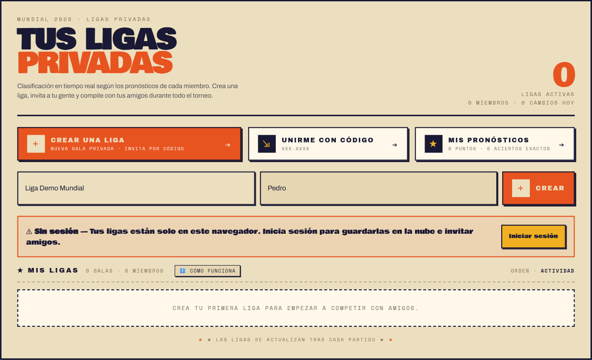
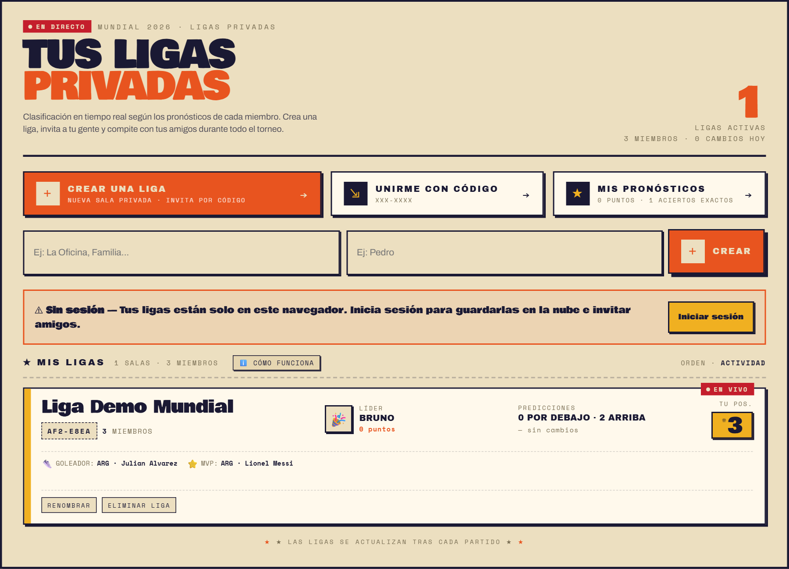
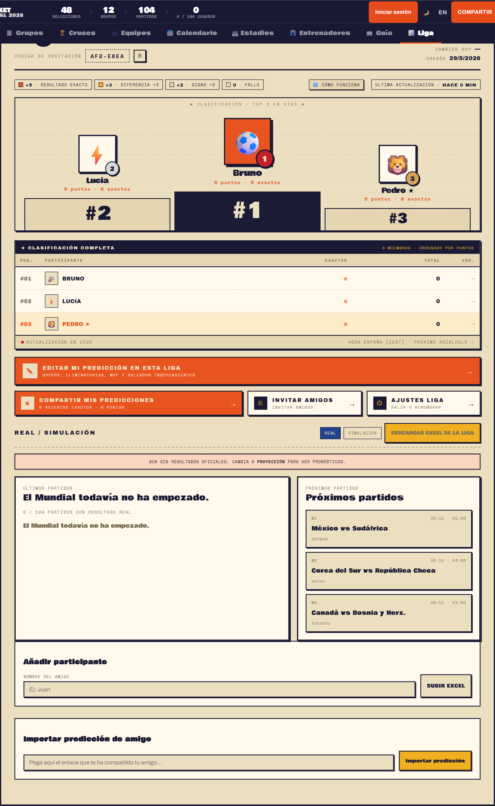
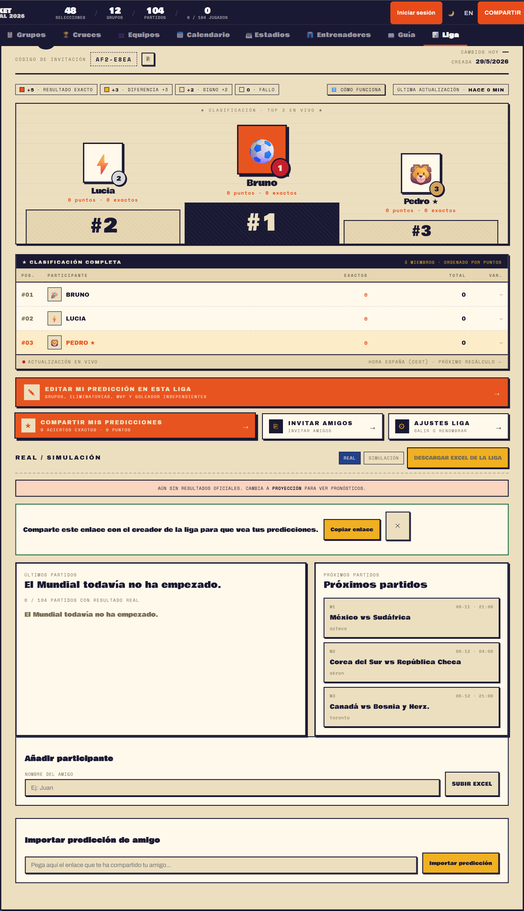
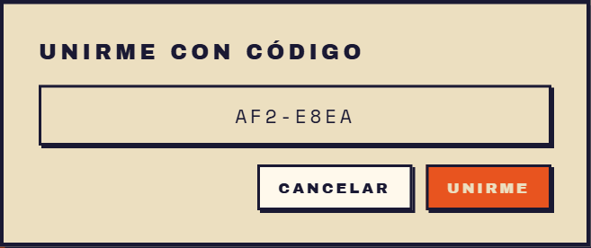

# Guia visual de ligas privadas

## Para que sirve esta funcionalidad
Las ligas privadas permiten competir con amigos usando el bracket del Mundial 2026. Cada participante rellena su propio pronostico y la app va recalculando la clasificacion segun se juegan los partidos reales.

Esta guia esta pensada para explicar el flujo real que existe hoy en la aplicacion, con pasos concretos y capturas de pantalla.

## Flujo recomendado
1. Entra en la pestaña Liga.
2. Crea una liga con nombre y apodo.
3. Abre la liga y revisa la clasificacion.
4. Invita a tus amigos desde el boton Invitar amigos.
5. Cada amigo entra a la liga y completa su bracket.
6. Cuando empiece el Mundial, la tabla se actualiza sola con los resultados reales.

## Paso 1. Entrar en Liga y preparar la creación
En la pantalla principal de ligas tienes tres accesos muy visibles:
- Crear una liga.
- Unirme con codigo.
- Mis pronosticos.

Debajo aparecen dos campos: uno para el nombre de la liga y otro para tu apodo dentro de ella.



### Que hacer aqui
1. Ve a la pestaña Liga.
2. Escribe el nombre de la liga.
3. Escribe tu apodo.
4. Pulsa Crear.

### Que significa el aviso amarillo
Si ves el mensaje Sin sesión, significa que tus ligas se quedarán solo en ese navegador hasta que inicies sesión. La funcionalidad sigue siendo usable, pero para compartir mejor entre dispositivos conviene iniciar sesión.

## Paso 2. Confirmar que la liga ya existe
Cuando la liga queda creada, pasa a aparecer en la lista inferior con:
- Nombre de la liga.
- Codigo de invitacion.
- Numero de miembros.
- Lider actual.
- Tu posicion.



### Que revisar en este punto
1. Que el nombre de la liga sea correcto.
2. Que aparezca el codigo de invitacion.
3. Que la tarjeta de la liga se pueda abrir pulsando sobre ella.

## Paso 3. Abrir la liga y revisar el panel principal
Al entrar en la liga verás el panel completo de seguimiento. Es la pantalla más importante de toda la funcionalidad.

Desde aqui puedes:
- Ver el codigo de invitacion.
- Consultar la clasificacion general.
- Editar tu prediccion para esta liga.
- Compartir tus predicciones.
- Invitar amigos.
- Descargar el Excel de la liga.
- Ver ultimos partidos y proximos partidos.



### Que hacer aqui
1. Revisa que tu liga tiene el nombre correcto.
2. Comprueba que la clasificacion aparece con todos los participantes.
3. Usa Editar mi prediccion en esta liga para rellenar tu bracket.
4. Usa Invitar amigos para compartir la liga.

### Nota importante sobre Invitar amigos
El metodo principal de invitacion hoy es el enlace generado desde la propia liga. Para que ese flujo quede bien asociado a la nube y funcione mejor entre dispositivos, es recomendable iniciar sesión antes de invitar.

## Paso 4. Compartir tus predicciones
Compartir una liga e importar una prediccion no son la misma cosa.

El boton Compartir mis predicciones genera un enlace pensado para que el creador de la liga, o quien gestione la clasificacion, pueda importar tu bracket dentro de una liga existente.



### Cuando usar esta opcion
- Cuando ya formas parte de una liga.
- Cuando quieres enviar tu bracket a otra persona.
- Cuando el creador de la liga va a importar tu prediccion manualmente.

### Pasos
1. Entra en la liga.
2. Pulsa Compartir mis predicciones.
3. Copia el enlace.
4. Enviaselo al creador o a la persona que vaya a importarlo.

## Paso 5. Unirse con codigo
La app tambien ofrece un acceso de Unirme con codigo. Visualmente es muy sencillo: introduces el codigo y confirmas la union.



### Pasos
1. Entra en Liga.
2. Pulsa Unirme con codigo.
3. Escribe el codigo de invitacion.
4. Pulsa Unirme.

### Importante
Hoy, el flujo mas fiable para incorporar a otra persona por primera vez sigue siendo el enlace de invitacion compartido por el creador. El codigo funciona mejor como acceso rapido dentro del contexto ya cargado en la app.

## Como compartir la liga con amigos
Si lo que quieres es meter a gente nueva en la liga, el flujo recomendado es este:

1. Crea la liga.
2. Inicia sesión.
3. Entra en la liga.
4. Pulsa Invitar amigos.
5. Copia el enlace de invitacion.
6. Envialo por WhatsApp, Telegram, mail o el canal que quieras.
7. Pide a cada amigo que entre con ese enlace y complete su bracket.

## Que ocurrira cuando empiece el Mundial
La clasificacion se recalcula automaticamente a medida que se juegan partidos reales.

### Puntuacion en fase de grupos
- Resultado exacto: 5 puntos.
- Diferencia de goles correcta: 3 puntos.
- Signo correcto del partido: 2 puntos.
- Fallo o sin pronostico: 0 puntos.

### Puntuacion en eliminatorias
La app suma puntos por acertar la progresion de los equipos en cada ronda. No se limita al marcador final de un unico partido: tambien importa haber colocado bien a cada seleccion en la ronda correcta.

### Ademas de la tabla general veras
- Lider actual.
- Posicion de cada participante.
- Aciertos exactos.
- Desglose de puntos.
- Ultimos partidos jugados.
- Proximos partidos.

## Antes de que empiece el torneo
Mientras no haya resultados oficiales, la liga puede verse en modo real o en simulacion/proyeccion. La clasificacion valida para competir es la que se recalcula con resultados reales, pero el modo simulacion sirve para probar escenarios antes del inicio del Mundial.

## Recomendacion operativa para grupos de amigos
Si vas a organizar una liga real con varias personas, esta es la secuencia mas segura:

1. El creador crea la liga y define el nombre final.
2. El creador inicia sesión.
3. El creador comparte el enlace de invitacion.
4. Cada participante entra y rellena su bracket antes del primer partido.
5. Si alguien no puede hacerlo dentro de la app, se puede importar su prediccion o añadirla manualmente.
6. Desde el inicio del torneo, la clasificacion se seguira sola partido a partido.

## Limitaciones actuales que conviene tener claras
1. La app habla de enlace y de codigo, pero no cumplen exactamente el mismo papel.
2. El login no es estrictamente obligatorio para todo, pero si es muy recomendable para compartir bien entre dispositivos.
3. Compartir la liga e importar una prediccion son dos acciones distintas.

## Regenerar las capturas
Estas capturas se pueden regenerar con el script:

```bash
npm run docs:league-shots
```

Los PNG se escriben en la carpeta docs/ligas-privadas-assets.