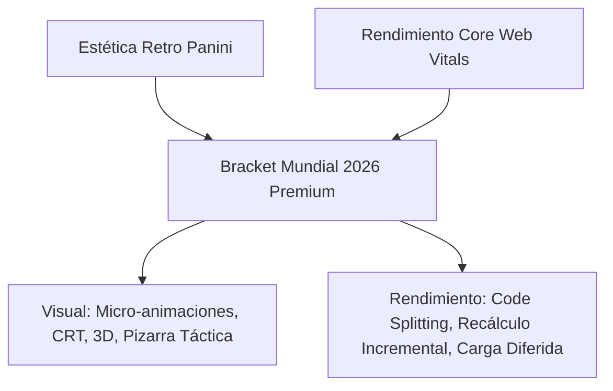

# Plan de Mejoras Visuales y de Rendimiento — Bracket Mundial 2026

Este documento detalla una hoja de ruta estratégica para elevar el **Bracket Mundial 2026** a un nivel premium de diseño (UX/UI) y rendimiento (Core Web Vitals), conservando y potenciando su identidad visual retro tipo álbum Panini.

---

## 1. Visión y Dirección Creativa

El proyecto destaca por su lenguaje visual retro de los años 80 y 90 (papel texturizado, tramas de semitono, sombras duras y colores saturados). Para que la aplicación se perciba como un producto de máxima calidad y deje una impresión memorable en el usuario, proponemos fusionar esta estética impresa clásica con técnicas interactivas y tecnologías de renderizado ultra-eficientes del desarrollo web moderno.



---

## 2. Propuestas de Mejora Visual y Experiencia de Usuario (UX)

### 2.1 Animación 3D de Apertura de Sobres (Foil Sticker Unpacking)
Para incentivar el uso de la sección de plantillas (`squads-view`), se propone implementar una simulación interactiva de apertura de sobres de cromos metalizados.
*   **Detalle Visual:** Cuando el usuario entra por primera vez o completa las predicciones de un grupo, recibe un "sobre virtual" tridimensional. Usando CSS 3D y `perspective`, el usuario rasga el sobre (con un efecto sonoro de papel rasgado y una estela de destellos en SVG/Canvas). Los cromos salen despedidos con un efecto de brillo metálico dinámico que cambia según el movimiento del ratón o la inclinación del móvil (giroscopio + gradientes cónicos).
*   **Archivos a Crear/Modificar:**
    *   `[NEW]` `src/components/sticker-pack.ts`: Elemento Lit que encapsula el sobre 3D y su interacción física.
    *   `[MODIFY]` `src/components/squads-view.ts`: Integrar el disparador del sobre al desbloquear o explorar selecciones.

### 2.2 Pizarra Táctica Interactiva (Enhanced Lineup View)
El campo de fútbol actual de `lineup-view.ts` muestra una distribución nominal estática de la alineación de un equipo.
*   **Detalle Visual:** Convertir el campo de fútbol en una pizarra táctica viva.
    *   **Drag & Drop:** Permitir que el usuario arrastre jugadores suplentes al campo para realizar sustituciones en tiempo real, con una animación de rotación física de la ficha estilo cromo.
    *   **Cambio de Formaciones:** Un selector interactivo (ej. 4-4-2, 4-3-3, 3-5-2) que desplace de forma fluida (usando Web Animations API o transiciones CSS con coordenadas relativas) las fichas a sus nuevas posiciones en el campo.
    *   **Líneas Tácticas:** Dibujar líneas sutiles de conexión táctica entre posiciones que brillen al pasar el cursor (hover).
*   **Archivos a Modificar:**
    *   `[MODIFY]` `src/components/lineup-view.ts`: Agregar soporte para Drag & Drop API, cálculo dinámico de coordenadas del grid táctico y animaciones fluidas de transición posicional.

### 2.3 Sistema de Zoom y Paneo Avanzado en el Árbol del Bracket
Con 104 partidos y fases eliminatorias complejas, navegar el bracket en pantallas móviles o portátiles pequeños puede ser incómodo.
*   **Detalle Visual:** Implementar un visor interactivo de SVG con soporte de gestos.
    *   **Pinch-to-Zoom y Pan:** Utilizar eventos táctiles nativos para ampliar, reducir y arrastrar el bracket suavemente.
    *   **Minimapa de Navegación:** Un pequeño recuadro flotante en la esquina inferior (estilo videojuego o herramienta de diseño) que muestre en qué sección del árbol se encuentra actualmente la vista y permita hacer clic para saltar a cuartos, semifinales, etc.
    *   **Conectores Dinámicos:** Los caminos de SVG que conectan partidos deben iluminarse con animaciones de flujo eléctrico retro (gradientes SVG animados con `dasharray` y `dashoffset`) reflejando qué equipo ha avanzado.
*   **Archivos a Modificar:**
    *   `[MODIFY]` `src/components/bracket-knockout.ts`: Integrar un controlador de transformaciones CSS (`transform: translate3d(...) scale(...)`) e inyectar el subcomponente del minimapa interactivo.

### 2.4 Micro-interacciones y Efectos CRT
Potenciar el alma "retro-arcade" del diseño global mediante detalles estéticos sutiles:
*   **Efecto CRT en Tema Oscuro:** Cuando se active el modo oscuro, inyectar temporalmente un leve parpadeo analógico (`scanlines`) y una distorsión de barrido CRT sobre los contenedores oscuros principales usando un overlay CSS de baja carga de CPU.
*   **Efecto Halftone Dinámico:** El fondo con patrón de semitono (`--halftone-soft`) puede reaccionar sutilmente al hacer hover sobre los botones o marcadores clave, ensanchando los puntos de la trama localmente mediante un filtro SVG interactivo o una transición de gradiente radial.
*   **Efectos de Sello Impreso (Rubber Stamp):** Al clasificar un equipo o guardar con éxito las predicciones, estampar un texto oblicuo con tipografía *Bowlby One* (ej. "¡CLASIFICADO!" o "COMPLETO") que caiga con rotación y escala física acompañadas de una vibración háptica ligera en móviles compatibles.

### 2.5 Gamificación del Álbum de Cromos
*   **Detalle Visual:** Una barra de progreso interactiva al estilo de "Cromos Coleccionados" en el menú superior. Muestra cuántos avatares reales de jugadores han sido descargados o descubiertos por el usuario, transformando la visualización de squads en una experiencia coleccionable directa.

---

## 3. Propuestas de Rendimiento y Optimización de Carga (Core Web Vitals)

A continuación, se presenta una tabla detallada con los cuellos de botella identificados en rendimiento y sus respectivas soluciones técnicas.

| Área / Métrica | Problema Detectado | Solución Técnica Propuesta | Esfuerzo | Impacto |
| :--- | :--- | :--- | :---: | :---: |
| **FCP / LCP** (Bundle inicial) | Carga monolítica en `app-root.ts` con más de 18 importaciones estáticas pesadas. | Carga diferida (`dynamic imports`) y Code Splitting de vistas secundarias. | Medio | **Muy Alto** |
| **FID / TBT** (Bloqueo de CPU) | `recalculateStandings` realiza backtracking completo de 104 partidos por cada gol. | Recálculo incremental reactivo limitado al grupo alterado y memoización. | Alto | **Alto** |
| **CLS** (Cumulative Layout Shift) | Recargas y escalados asíncronos en avatares de squads provocan saltos visuales. | Contención CSS (`contain: layout size`) y reservas de relación de aspecto explícitas. | Bajo | **Medio** |
| **TBT** (Renderizado de SVG) | Conectores SVG de eliminatorias redibujan todo el DOM en cada redimensión. | Usar `ResizeObserver` combinado con transformaciones CSS en vez de alterar atributos SVG. | Medio | **Alto** |
| **Métricas de PWA** | Las llamadas del feed de cuotas y noticias bloquean la hidratación de la UI. | Arquitectura de placeholders optimizados (Skeletons retro) y carga no bloqueante. | Bajo | **Medio** |

### 3.1 Lazy Loading de Vistas en `app-root.ts`
Actualmente, todas las vistas del bracket se cargan al inicio. Esto penaliza severamente el rendimiento móvil.
*   **Implementación:**
    1.  Eliminar imports estáticos como `import './components/stadiums-view'` o `import './components/coaches-view'`.
    2.  Implementar un router interno dinámico en `app-root.ts` que escuche la propiedad `_activeTab` y cargue el componente en caliente mediante `import()` asíncrono.
    3.  Durante la carga, mostrar un esqueleto (`<div class="skeleton-card">`) con textura de cartón Panini en proceso de impresión para mantener la inmersión visual.

```typescript
// Ejemplo de implementación de lazy loading para Lit
private async _renderTabContent() {
  switch (this._activeTab) {
    case 'stadiums':
      await import('./components/stadiums-view');
      return html`<stadiums-view></stadiums-view>`;
    case 'coaches':
      await import('./components/coaches-view');
      return html`<coaches-view></coaches-view>`;
    // ... rest of tabs
    default:
      return html`<hero-view></hero-view>`;
  }
}
```

### 3.2 Recálculo de Estado Incremental y Reactivo
Cada alteración de un marcador llama a una cadena de ordenamiento que procesa todos los grupos de la copa.
*   **Implementación:**
    1.  Reescribir el store de Zustand para segmentar el estado.
    2.  Cuando un partido del Grupo A cambia, la mutación solo debe actualizar el array de partidos de dicho grupo, computando de forma aislada la tabla del Grupo A.
    3.  Los mejores terceros del torneo (`getBestThirds`) solo deben reevaluarse si el equipo en la tercera posición del grupo alterado ha cambiado de puntaje, en lugar de realizar una clasificación general ciega tras cada evento.

### 3.3 Contención CSS en Tarjetas del Bracket
El bracket elimina tarjetas del flujo normal para posicionarlas de forma absoluta o en grids SVG complejos.
*   **Implementación:**
    *   Aplicar `contain: layout paint style` en los contenedores individuales de partidos (`.ko-match-card`). Esto le indica al motor de renderizado del navegador (Chromium/Webkit) que los cambios internos de tamaño, texto o colores de una tarjeta no afectan al diseño de las tarjetas vecinas, reduciendo las pasadas de Layout a $O(1)$ en lugar de forzar un re-layout del árbol completo de eliminatorias.

### 3.4 Optimización de Red en i18n
*   **Implementación:**
    *   Actualmente, todos los textos y localizaciones de la app están bundleados. Proponemos mover las traducciones a archivos estáticos `.json` en `public/locales/` y cargarlos bajo demanda según el idioma seleccionado mediante fetch dinámico en el constructor del `useLocaleStore`.

---

## 4. Plan de Ejecución y Priorización por Sprints

Para implementar este plan de manera segura y sin poner en riesgo la estabilidad de la lógica de negocio actual del torneo, dividiremos los esfuerzos en 4 Sprints quincenales estructurados según el retorno de inversión (ROI):

```text
[Sprint 1: Rendimiento Crítico] ──> [Sprint 2: Usabilidad & Navegación] ──> [Sprint 3: Inmersión Visual 3D] ──> [Sprint 4: Gamificación & Pulido]
```

### Sprint 1: Rendimiento Crítico e Infraestructura (Cero regresiones)
> [!IMPORTANT]
> El objetivo prioritario es reducir el tiempo de carga inicial en redes móviles lentas y evitar bloqueos en el hilo principal de renderizado.

- **Tarea 1.1:** Migrar a dynamic imports (`lazy loading`) en el selector de pestañas de `app-root.ts`.
- **Tarea 1.2:** Dividir bundles de i18n para carga bajo demanda según locale.
- **Tarea 1.3:** Agregar `contain` de CSS a las tarjetas de partidos y celdas del fixture para acelerar recalculados de pantalla.
- **Verificación:** Ejecutar `npm run build` y auditar con Lighthouse, buscando elevar la métrica de *Performance* en móvil por encima de 92.

### Sprint 2: Usabilidad, Zoom y Accesibilidad del Bracket
> [!TIP]
> Mejorar la interacción del usuario en la pantalla central de la app (el bracket de eliminatorias) en todo tipo de dispositivos.

- **Tarea 2.1:** Implementar el visor SVG con controles de Zoom y Pan interactivo en `bracket-knockout.ts`.
- **Tarea 2.2:** Diseñar el minimapa interactivo flotante de navegación rápida.
- **Tarea 2.3:** Integrar el servicio compartido de apertura de `match-modal` para homogeneizar la interacción de la app.
- **Verificación:** Probar en dispositivos con viewports estrechos (menos de 375px de ancho) y validar que el zoom táctil responde sin tirones (60 FPS estables).

### Sprint 3: Experiencia Visual Retro Inmersiva (Stickers 3D)
> [!NOTE]
> Transformar las pantallas utilitarias en una experiencia que asombre al usuario mediante técnicas avanzadas de animación web.

- **Tarea 3.1:** Crear la animación 3D de sobre metalizado para la apertura de plantillas (`sticker-pack.ts`).
- **Tarea 3.2:** Integrar efectos visuales CRT interactivos y transiciones de tramas de semitono al intercambiar temas claro/oscuro.
- **Tarea 3.3:** Añadir las estelas de flujo eléctrico (dashoffset) sobre los conectores SVG del bracket que indican el avance de selecciones clasificadas.

### Sprint 4: Pizarra Táctica Interactiva y Gamificación
> [!NOTE]
> Potenciar la jugabilidad interna del bracket y refinar los detalles finales de UX.

- **Tarea 4.1:** Construir la interacción Drag & Drop para el intercambio posicional de jugadores en `lineup-view.ts`.
- **Tarea 4.2:** Desarrollar las transiciones fluidas al cambiar el dibujo de formación táctica.
- **Tarea 4.3:** Incorporar la barra de progreso de "colección de cromos" en el shell superior de la PWA.

---

## 5. Glosario de Archivos Clave Involucrados

Para facilitar el seguimiento técnico durante la implementación, estos son los archivos principales del repositorio que serán editados:

1.  [`src/app-root.ts`](file:///d:/Personal/bracketMundial/src/app-root.ts): Enrutador e inyección asíncrona de componentes.
2.  [`src/index.css`](file:///d:/Personal/bracketMundial/src/index.css): Registro de variables CRT, efectos 3D y semitonos interactivos.
3.  [`src/components/bracket-knockout.ts`](file:///d:/Personal/bracketMundial/src/components/bracket-knockout.ts): Renderizado modularizado del bracket, visor táctil de Zoom/Pan e inyección del Minimapa.
4.  [`src/components/lineup-view.ts`](file:///d:/Personal/bracketMundial/src/components/lineup-view.ts): Lógica táctica interactiva, arrastre y animaciones de formación del once titular.
5.  [`src/store/tournament-store.ts`](file:///d:/Personal/bracketMundial/src/store/tournament-store.ts): Reducción de granularidad de actualizaciones y optimización incremental de standings.
6.  [`src/i18n/index.ts`](file:///d:/Personal/bracketMundial/src/i18n/index.ts): Sistema de carga diferida de ficheros de idioma externos.
