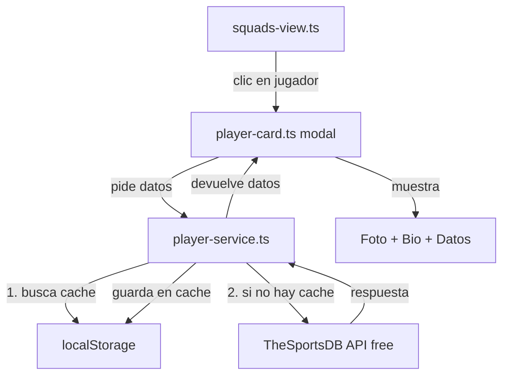

# Fichas de Jugadores Reales — 100% Gratuito

Integrar datos reales de los ~1248 jugadores del Mundial 2026: fotos, biografía, datos físicos y redes sociales. Todo con **TheSportsDB free tier** (key `3`), sin coste alguno.

## Decisiones Tomadas

| Decisión | Elección |
|----------|----------|
| **API** | TheSportsDB free (key `3`) — $0 |
| **Fotos** | Desde CDN de TheSportsDB (sin descarga local, 0 peso en repo) |
| **Cache** | localStorage para offline tras primera carga |
| **UI** | Modal tipo ficha Panini retro al clic en jugador |
| **Idioma** | Español cuando exista (`strDescriptionES`), fallback a inglés |
| **Stats temporada** | No (requeriría API de pago). Solo datos biográficos y físicos |

## Arquitectura



## Datos Disponibles por Jugador (Gratis)

Verificado con Chris Wood (NZL):

| Campo | Ejemplo | Fuente |
|-------|---------|--------|
| Foto recortada (PNG) | `strCutout` | CDN TheSportsDB |
| Foto thumbnail | `strThumb` | CDN TheSportsDB |
| Render artístico | `strRender` | CDN TheSportsDB |
| Altura | `1.88 m (6 ft 2 in)` | API |
| Peso | `179 lbs` | API |
| Fecha nacimiento | `1991-12-07` | API |
| Ciudad natal | `Auckland, New Zealand` | API |
| Pie dominante | `Right` | API |
| Biografía EN | ✅ (párrafo completo) | API |
| Biografía ES | Parcial (no todos los jugadores) | API |
| Twitter/Instagram | URLs | API |

## Cambios Propuestos

### 1. Servicio de Datos con Cache

#### [NUEVO] `src/lib/player-service.ts`

Servicio que gestiona datos enriquecidos de jugadores:

```typescript
interface PlayerDetail {
  id: string;
  name: string;
  team: string;
  position: string;
  height?: string;
  weight?: string;
  birthDate?: string;
  birthPlace?: string;
  foot?: string;
  description?: string;
  photoUrl?: string;    // strCutout o strThumb
  thumbUrl?: string;
  twitter?: string;
  instagram?: string;
}
```

Lógica:
1. `searchPlayer(name, teamName)` → busca por nombre en TheSportsDB
2. `getPlayerDetail(thesportsdbId)` → perfil completo
3. Cache en `localStorage` con TTL de 7 días
4. Key de cache: `player:{teamId}:{playerNumber}`
5. Rate limiting interno: máx 2 req/segundo para no saturar la API

### 2. Componente Modal — Ficha de Jugador

#### [NUEVO] `src/components/player-card.ts`

Componente `<player-card>` con estilo retro álbum Panini:

```
┌──────────────────────────────────┐
│  [← Cerrar]          #9 · FW    │
│                                  │
│      ┌──────────┐               │
│      │  FOTO    │  Chris Wood    │
│      │ (cutout) │  🇳🇿 N. Zelanda│
│      └──────────┘               │
│                                  │
│  ─────────────────────────────  │
│  Nottingham Forest    1.88m     │
│  Pie derecho          34 años   │
│  Auckland, NZ                   │
│  ─────────────────────────────  │
│                                  │
│  Biografía corta del jugador... │
│                                  │
│  [🐦 Twitter]  [📷 Instagram]   │
└──────────────────────────────────┘
```

Estilos:
- Fondo `var(--paper)`, borde grueso `var(--ink)`
- Foto con marco retro y sombra dura
- Tipografía `var(--font-display)` y `var(--font-mono)`
- Animación de entrada con transform
- Silueta genérica como fallback si no hay foto

### 3. Integración en Squads View

#### [MODIFICAR] `src/components/squads-view.ts`

- Añadir mini-avatar (~32px circular) en cada fila de la tabla
- Hacer filas clicables → abre `<player-card>` como modal overlay
- Estado local `selectedPlayer` para controlar qué modal está abierto
- Lazy loading de fotos con `loading="lazy"`
- Fallback: círculo con iniciales del jugador si no hay foto cargada aún

### 4. Modelo de Datos Extendido

#### [MODIFICAR] `src/data/squads/index.ts`

- Añadir campo opcional `thesportsdbId?: string` a la interfaz `Player`
- No es obligatorio rellenarlo manualmente — el servicio busca por nombre

## Flujo del Usuario

1. **Entra a "Plantillas"** → ve la tabla de jugadores como siempre, pero ahora con mini-avatares
2. **Clic en un jugador** → se abre el modal con indicador de carga
3. **Primera vez**: el servicio busca en TheSportsDB (0.5-1s), cachea el resultado
4. **Visitas siguientes**: datos instantáneos desde localStorage
5. **Offline**: si ya cacheó los datos, funciona sin internet. Si no, muestra datos estáticos (nombre, posición, club) sin foto

## Fases de Implementación

| Fase | Tarea | Estimación |
|------|-------|------------|
| 1 | `player-service.ts` — servicio + cache + rate limiting | 30 min |
| 2 | `player-card.ts` — modal ficha Panini con datos | 45 min |
| 3 | Modificar `squads-view.ts` — avatares + clic → modal | 30 min |
| 4 | Polish: fallbacks, lazy loading, responsive, búsqueda | 30 min |

## Verificación

- `npm test` para verificar que no rompe nada existente
- Abrir plantilla de NZL → verificar mini-avatares en tabla
- Clic en Chris Wood → verificar modal con foto, bio, datos
- Refrescar página → verificar carga instantánea desde cache
- Desconectar internet → verificar que datos cacheados siguen visibles
- Probar en móvil (≤768px) → verificar responsive del modal
