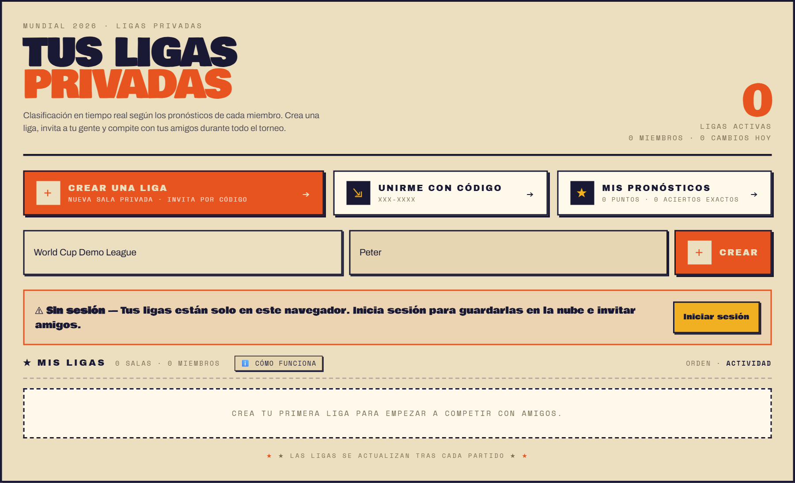
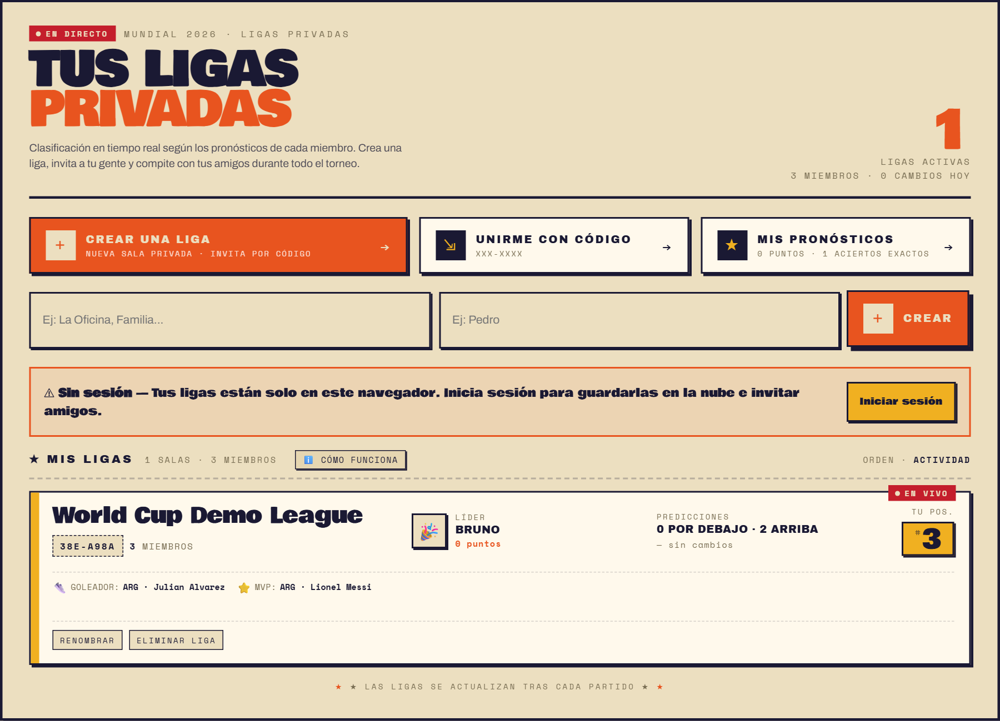
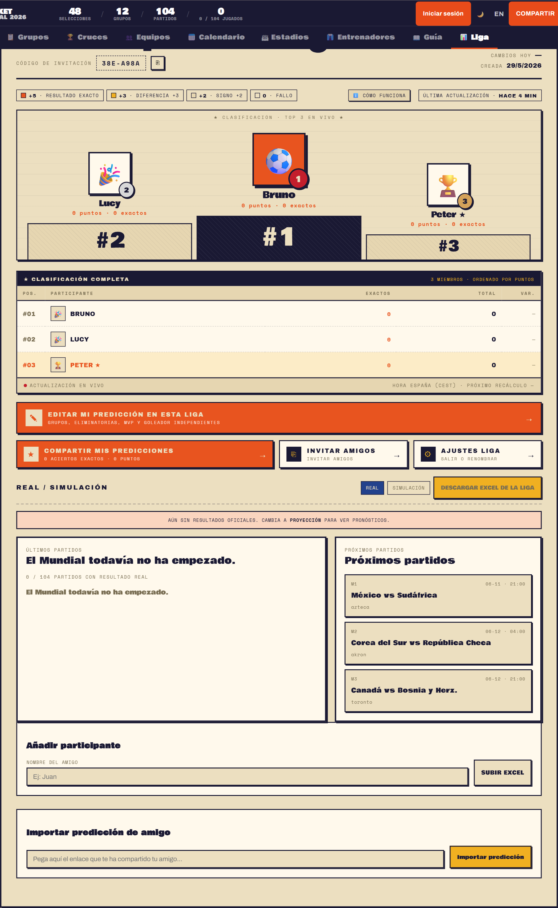
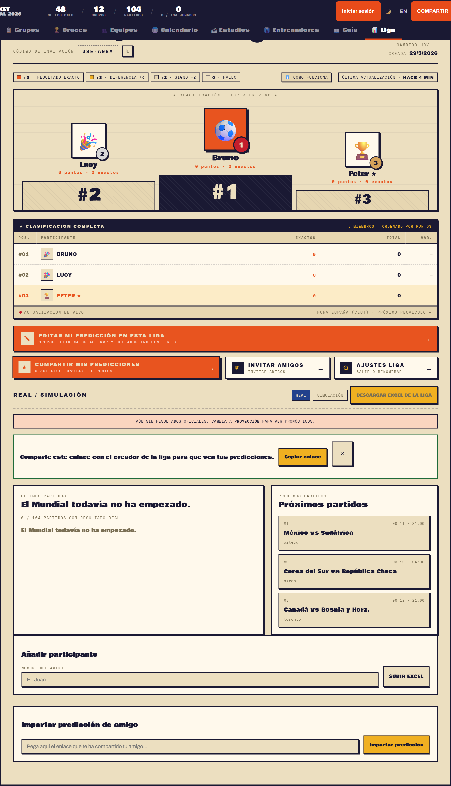
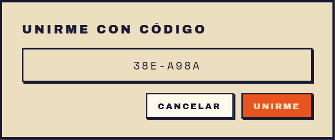

# Private leagues visual guide

## Purpose
This guide explains how private leagues currently work in Bracket Mundial 2026, with step-by-step instructions and real screenshots from the app.

## Recommended flow
1. Open the League tab.
2. Create a league with a name and your nickname.
3. Open the league and review the leaderboard.
4. Invite your friends from the Invite friends button.
5. Each friend joins the league and fills in their bracket.
6. Once the World Cup starts, the leaderboard updates automatically with real results.

## Step 1. Open League and prepare the creation form
The League screen gives you three clear entry points:
- Create a league.
- Join with code.
- My predictions.

Below them, you will see two fields: one for the league name and one for your nickname.



### What to do here
1. Go to the League tab.
2. Enter the league name.
3. Enter your nickname.
4. Click Create.

### What the yellow warning means
If you see the No session warning, your leagues are only stored in this browser until you sign in. The feature still works, but signing in is recommended if you want better cross-device sharing.

## Step 2. Confirm that the league already exists
After creating it, the league appears in the list below with:
- League name.
- Invite code.
- Number of members.
- Current leader.
- Your position.



### What to check here
1. The league name is correct.
2. The invite code is visible.
3. The league card opens when you click it.

## Step 3. Open the league and review the main panel
Inside the league you get the full tracking panel. This is the most important screen in the whole flow.

From here you can:
- See the invite code.
- Review the leaderboard.
- Edit your prediction for this league.
- Share your predictions.
- Invite friends.
- Download the league Excel file.
- Review recent matches and upcoming matches.



### What to do here
1. Check that the league name is correct.
2. Confirm the leaderboard shows all participants.
3. Use Edit my prediction in this league to complete your bracket.
4. Use Invite friends to share the league.

### Important note about Invite friends
Today, the main invitation method is the share link generated from inside the league. Signing in is strongly recommended before inviting people so the cloud-based flow works better across devices.

## Step 4. Share your predictions
Sharing a league and importing a prediction are not the same action.

The Share my predictions button creates a link intended for the league owner, or the person managing the standings, to import your bracket into an existing league.



### When to use this option
- When you are already part of a league.
- When you want to send your bracket to someone else.
- When the league owner will import your prediction manually.

### Steps
1. Open the league.
2. Click Share my predictions.
3. Copy the link.
4. Send it to the owner or to the person who will import it.

## Step 5. Join with code
The app also offers a Join with code entry point. Visually it is simple: enter the code and confirm the action.



### Steps
1. Open League.
2. Click Join with code.
3. Enter the invite code.
4. Click Join.

### Important
Today, the most reliable way to bring a new person into a league is still the invitation link shared by the owner. The code works better as a quick access method inside the app context that already knows about the league.

## How to share the league with friends
If you want to bring new people into the league, the recommended sequence is:

1. Create the league.
2. Sign in.
3. Open the league.
4. Click Invite friends.
5. Copy the invitation link.
6. Send it through WhatsApp, Telegram, email or any other channel.
7. Ask each friend to open the link and fill in their bracket.

## What happens once the World Cup starts
The leaderboard is recalculated automatically as real match results are played.

### Group stage scoring
- Exact score: 5 points.
- Correct goal difference: 3 points.
- Correct outcome: 2 points.
- Miss or no prediction: 0 points.

### Knockout stage scoring
The app awards points for correctly predicting how teams progress through each round. It is not limited to a single final score: it also rewards placing teams in the round they actually reach.

### On top of the leaderboard you will also see
- Current leader.
- Each participant's rank.
- Exact picks.
- Points breakdown.
- Latest played matches.
- Upcoming matches.

## Before the tournament starts
While there are no official results yet, the league can be viewed in real mode or in simulation/projection mode. The valid competition table is the one calculated from real results, but simulation is useful to test scenarios before kickoff.

## Recommended operating flow for a real group of friends
1. The owner creates the league and sets the final name.
2. The owner signs in.
3. The owner shares the invitation link.
4. Each participant joins and fills in their bracket before the first match.
5. If someone cannot do it inside the app, their prediction can still be imported or added manually.
6. Once the tournament begins, the leaderboard updates match by match.

## Current limitations you should keep in mind
1. The app uses both link and code language, but they do not play exactly the same role.
2. Login is not strictly mandatory for every local action, but it is highly recommended for reliable sharing across devices.
3. Sharing a league and sharing a prediction are two different actions.

## Regenerate the screenshots
You can regenerate these screenshots with:

```bash
npm run docs:league-shots:en
```

The PNG files are written into docs/private-leagues-assets.
